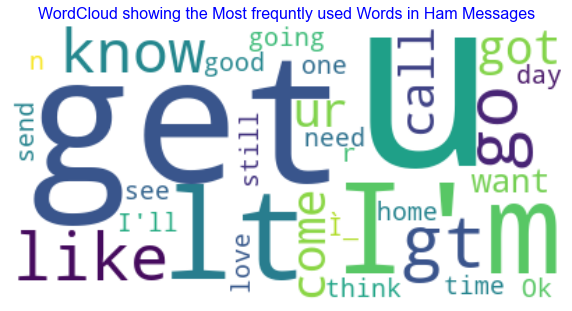
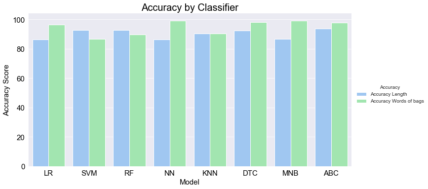

# Unstructured Data Analysis Project

**Unstructured data analysis** refers to the process of extracting insights and meaningful information from unstructured data, such as text, images, and videos. Unlike structured data, which is organized in a specific format and can be easily analyzed using traditional statistical and analytical methods, unstructured data is typically not organized in a specific way and requires specialized tools and techniques to extract insights.

There are several techniques and tools used in unstructured data analysis, including natural language processing (NLP), machine learning algorithms, and data visualization. Some common applications of unstructured data analysis include sentiment analysis of customer reviews, topic modeling of social media posts, and image recognition for medical imaging.

NLP is one of the most widely used techniques in unstructured data analysis, which involves processing and analyzing human language data. NLP techniques can be used to extract and classify key topics, identify sentiment and emotion, and perform text summarization.

## Importing Required Libraries


```python
import numpy as np
import pandas as pd
import seaborn as sns

import matplotlib.pyplot as plt
from matplotlib import pyplot

import warnings
%matplotlib inline

warnings.filterwarnings("ignore")
```


```python

import nltk
nltk.download('stopwords')
from nltk.tokenize import word_tokenize, sent_tokenize, TreebankWordTokenizer
from nltk.corpus import stopwords
from nltk.stem import PorterStemmer


import sklearn
from sklearn.model_selection import train_test_split
from sklearn.linear_model import LogisticRegression
from sklearn import svm
from sklearn.svm import SVC
from sklearn .ensemble import RandomForestClassifier, AdaBoostClassifier
from sklearn.neural_network import MLPClassifier
from sklearn.neighbors import KNeighborsClassifier
from sklearn.tree import DecisionTreeClassifier
from sklearn.naive_bayes import MultinomialNB
from sklearn.feature_extraction.text import CountVectorizer, TfidfTransformer, TfidfVectorizer


from sklearn.pipeline import  Pipeline


from sklearn import metrics
from sklearn.metrics import precision_score
from sklearn.metrics import recall_score
from sklearn.metrics import accuracy_score

from collections import Counter
from wordcloud import WordCloud


```

    [nltk_data] Downloading package stopwords to
    [nltk_data]     C:\Users\hp\AppData\Roaming\nltk_data...
    [nltk_data]   Package stopwords is already up-to-date!
    

## About Data

### Context of the data
The SMS Spam Collection is a set of SMS tagged messages that have been collected for SMS Spam research. It contains one set of SMS messages in English of `5,574 messages`, tagged acording being `ham (legitimate)` or `spam`.

### Content of the data
The files contain one message per line. Each line is composed by two columns: `v1` contains the label (ham or spam) and `v2` contains the raw text.

This corpus has been collected from free or free for research sources at the Internet:

* A collection of `425 SMS spam messages` was manually extracted from the Grumbletext Web site. This is a UK forum in which cell phone users make public claims about SMS spam messages, most of them without reporting the very spam message received. The identification of the text of spam messages in the claims is a very hard and time-consuming task, and it involved carefully scanning hundreds of web pages. The Grumbletext Web site is: [Web Link].
*  A subset of `3,375 SMS` randomly chosen ham messages of the NUS SMS Corpus (NSC), which is a dataset of about 10,000 legitimate messages collected for research at the Department of Computer Science at the National University of Singapore. The messages largely originate from Singaporeans and mostly from students attending the University. These messages were collected from volunteers who were made aware that their contributions were going to be made publicly available. The NUS SMS Corpus is avalaible at: [Web Link].
*  A list of `450 SMS` ham messages collected from Caroline Tag's PhD Thesis available at [Web Link].
*  Finally, we have incorporated the SMS Spam Corpus v.0.1 Big. It has 1,002 SMS ham messages and 322 spam messages and it is public available at: [Web Link]. This corpus has been used in the following academic researches:

##  Importing Data


```python
data = pd.read_csv('spam.csv',  encoding='latin-1')
data.head()
```


<div>
<table border="1" class="dataframe">
  <thead>
    <tr style="text-align: right;">
      <th></th>
      <th>v1</th>
      <th>v2</th>
      <th>Unnamed: 2</th>
      <th>Unnamed: 3</th>
      <th>Unnamed: 4</th>
    </tr>
  </thead>
  <tbody>
    <tr>
      <th>0</th>
      <td>ham</td>
      <td>Go until jurong point, crazy.. Available only ...</td>
      <td>NaN</td>
      <td>NaN</td>
      <td>NaN</td>
    </tr>
    <tr>
      <th>1</th>
      <td>ham</td>
      <td>Ok lar... Joking wif u oni...</td>
      <td>NaN</td>
      <td>NaN</td>
      <td>NaN</td>
    </tr>
    <tr>
      <th>2</th>
      <td>spam</td>
      <td>Free entry in 2 a wkly comp to win FA Cup fina...</td>
      <td>NaN</td>
      <td>NaN</td>
      <td>NaN</td>
    </tr>
    <tr>
      <th>3</th>
      <td>ham</td>
      <td>U dun say so early hor... U c already then say...</td>
      <td>NaN</td>
      <td>NaN</td>
      <td>NaN</td>
    </tr>
    <tr>
      <th>4</th>
      <td>ham</td>
      <td>Nah I don't think he goes to usf, he lives aro...</td>
      <td>NaN</td>
      <td>NaN</td>
      <td>NaN</td>
    </tr>
  </tbody>
</table>
</div>


## Checking Data dimension


```python
data.shape
```


    (5572, 5)


## Last columns seem to be unnecessary, check if there are values in there


```python
sum = data.isnull().sum()
percentage  = round((sum/data.isnull().count())*100,2)
Missing = pd.DataFrame([sum, percentage],
                      index=["Missing Values", "Missing Values(%)"])
Missing
```


<div>
<table border="1" class="dataframe">
  <thead>
    <tr style="text-align: right;">
      <th></th>
      <th>v1</th>
      <th>v2</th>
      <th>Unnamed: 2</th>
      <th>Unnamed: 3</th>
      <th>Unnamed: 4</th>
    </tr>
  </thead>
  <tbody>
    <tr>
      <th>Missing Values</th>
      <td>0.0</td>
      <td>0.0</td>
      <td>5522.0</td>
      <td>5560.00</td>
      <td>5566.00</td>
    </tr>
    <tr>
      <th>Missing Values(%)</th>
      <td>0.0</td>
      <td>0.0</td>
      <td>99.1</td>
      <td>99.78</td>
      <td>99.89</td>
    </tr>
  </tbody>
</table>
</div>


## Report on Missing Values
* Cloumn `v1` and `v2` have no missing values while the last three have more than `99%` missing values, therefore it's appropriate to remove them.
* Rename columns `v1` and `v2`.

### Dropping The last 3 columns


```python
data.drop(["Unnamed: 2", "Unnamed: 3", "Unnamed: 4"], axis=1, inplace=True)
```


```python
data.columns = ["label", "text"]
data.head()
```


<div>
<table border="1" class="dataframe">
  <thead>
    <tr style="text-align: right;">
      <th></th>
      <th>label</th>
      <th>text</th>
    </tr>
  </thead>
  <tbody>
    <tr>
      <th>0</th>
      <td>ham</td>
      <td>Go until jurong point, crazy.. Available only ...</td>
    </tr>
    <tr>
      <th>1</th>
      <td>ham</td>
      <td>Ok lar... Joking wif u oni...</td>
    </tr>
    <tr>
      <th>2</th>
      <td>spam</td>
      <td>Free entry in 2 a wkly comp to win FA Cup fina...</td>
    </tr>
    <tr>
      <th>3</th>
      <td>ham</td>
      <td>U dun say so early hor... U c already then say...</td>
    </tr>
    <tr>
      <th>4</th>
      <td>ham</td>
      <td>Nah I don't think he goes to usf, he lives aro...</td>
    </tr>
  </tbody>
</table>
</div>


## Checking Count of labels categories


```python
colors = ["#ff9999", "#66b3ff"]
```


```python
data['label'].value_counts()
```


    ham     4825
    spam     747
    Name: label, dtype: int64


```python
data['label'].value_counts().plot(kind = "pie", colors = colors, explode = (0.1,0), autopct ="%1.1f%%")
```


    <AxesSubplot:ylabel='label'>


    

    


13.4% of dataset are spam messages, other 86.6% are not

Most popular "ham" text: 'Sorry, I'll call later', recurse 30 times.
Most popular "spam" text= 'Please call our customer service representative ...', recurse 4 times

### WordCloud
* A wordcloud is a visual representation of a collection of words where the size of each word represents its frequency or importance within the collection.
* Word clouds are often used to quickly convey the most common or prominent words in a text or dataset, and they can be useful for analyzing and summarizing large amounts of textual data.


```python

stop_words = set(stopwords.words('english'))
spam_text =data.loc[data['label']== 'spam']
ham_text = data.loc[data['label'] == 'ham']

```


```python
#counts the number of times a word appears in a text
count_ham = Counter(" ".join(data[data['label']=='ham']['text']).split()).most_common(100)
common_Ham = pd.DataFrame.from_dict(count_ham)[0]
common_ham = common_Ham.str.cat(sep = ' ')

count_spam = Counter(" ".join(data[data['label'] == 'spam']['text']).split()).most_common(100)
common_Spam = pd.DataFrame.from_dict(count_spam)[0]
common_spam = common_Spam.str.cat(sep=' ')

```


```python
wordcloud_ham = WordCloud(stopwords = stop_words, background_color='white')
wordcloud_ham.generate(common_ham)
plt.figure(figsize=(10,6))
plt.imshow(wordcloud_ham, interpolation='bilinear')
plt.title("WordCloud showing the Most frequntly used Words in Ham Messages", fontsize = 16)
plt.axis('off')
plt.show()
```


    

    


```python
wordcloud_spam = WordCloud(stopwords=stop_words, background_color='white')
wordcloud_spam.generate(common_spam)
plt.figure(figsize=(10,6))
plt.imshow(wordcloud_spam, interpolation='bilinear')
plt.title("WordCloud showing the Most frequntly used Words in Spam Messages", fontsize = 16)
plt.axis('off')
plt.show()
```


    

    


## Generating Frequency


```python
data.groupby('label').describe()
```


<div>
<style scoped>
    .dataframe tbody tr th:only-of-type {
        vertical-align: middle;
    }

    .dataframe tbody tr th {
        vertical-align: top;
    }

    .dataframe thead tr th {
        text-align: left;
    }

    .dataframe thead tr:last-of-type th {
        text-align: right;
    }
</style>
<table border="1" class="dataframe">
  <thead>
    <tr>
      <th></th>
      <th colspan="4" halign="left">text</th>
    </tr>
    <tr>
      <th></th>
      <th>count</th>
      <th>unique</th>
      <th>top</th>
      <th>freq</th>
    </tr>
    <tr>
      <th>label</th>
      <th></th>
      <th></th>
      <th></th>
      <th></th>
    </tr>
  </thead>
  <tbody>
    <tr>
      <th>ham</th>
      <td>4825</td>
      <td>4516</td>
      <td>Sorry, I'll call later</td>
      <td>30</td>
    </tr>
    <tr>
      <th>spam</th>
      <td>747</td>
      <td>653</td>
      <td>Please call our customer service representativ...</td>
      <td>4</td>
    </tr>
  </tbody>
</table>
</div>


* Add variable length
* Change spam to dummy -> spam = 1, ham = 0

## Generating Length of the text


```python
data['length'] = data['text'].apply(len)
data.head()
```


<div>
<style scoped>
    .dataframe tbody tr th:only-of-type {
        vertical-align: middle;
    }

    .dataframe tbody tr th {
        vertical-align: top;
    }

    .dataframe thead th {
        text-align: right;
    }
</style>
<table border="1" class="dataframe">
  <thead>
    <tr style="text-align: right;">
      <th></th>
      <th>label</th>
      <th>text</th>
      <th>length</th>
    </tr>
  </thead>
  <tbody>
    <tr>
      <th>0</th>
      <td>ham</td>
      <td>Go until jurong point, crazy.. Available only ...</td>
      <td>111</td>
    </tr>
    <tr>
      <th>1</th>
      <td>ham</td>
      <td>Ok lar... Joking wif u oni...</td>
      <td>29</td>
    </tr>
    <tr>
      <th>2</th>
      <td>spam</td>
      <td>Free entry in 2 a wkly comp to win FA Cup fina...</td>
      <td>155</td>
    </tr>
    <tr>
      <th>3</th>
      <td>ham</td>
      <td>U dun say so early hor... U c already then say...</td>
      <td>49</td>
    </tr>
    <tr>
      <th>4</th>
      <td>ham</td>
      <td>Nah I don't think he goes to usf, he lives aro...</td>
      <td>61</td>
    </tr>
  </tbody>
</table>
</div>


## Creating Dummy variable for the label


```python
data = pd.get_dummies(data, columns = ['label'], prefix = "Dummy", drop_first=True)
data.head()
```


<div>
<style scoped>
    .dataframe tbody tr th:only-of-type {
        vertical-align: middle;
    }

    .dataframe tbody tr th {
        vertical-align: top;
    }

    .dataframe thead th {
        text-align: right;
    }
</style>
<table border="1" class="dataframe">
  <thead>
    <tr style="text-align: right;">
      <th></th>
      <th>text</th>
      <th>length</th>
      <th>Dummy_spam</th>
    </tr>
  </thead>
  <tbody>
    <tr>
      <th>0</th>
      <td>Go until jurong point, crazy.. Available only ...</td>
      <td>111</td>
      <td>0</td>
    </tr>
    <tr>
      <th>1</th>
      <td>Ok lar... Joking wif u oni...</td>
      <td>29</td>
      <td>0</td>
    </tr>
    <tr>
      <th>2</th>
      <td>Free entry in 2 a wkly comp to win FA Cup fina...</td>
      <td>155</td>
      <td>1</td>
    </tr>
    <tr>
      <th>3</th>
      <td>U dun say so early hor... U c already then say...</td>
      <td>49</td>
      <td>0</td>
    </tr>
    <tr>
      <th>4</th>
      <td>Nah I don't think he goes to usf, he lives aro...</td>
      <td>61</td>
      <td>0</td>
    </tr>
  </tbody>
</table>
</div>


## Remove Stopwords


```python
stop = stopwords.words('english')
data['text'].apply(lambda x: [item for item in x if item not in stop])
data.head()
```


<div>
<style scoped>
    .dataframe tbody tr th:only-of-type {
        vertical-align: middle;
    }

    .dataframe tbody tr th {
        vertical-align: top;
    }

    .dataframe thead th {
        text-align: right;
    }
</style>
<table border="1" class="dataframe">
  <thead>
    <tr style="text-align: right;">
      <th></th>
      <th>text</th>
      <th>length</th>
      <th>Dummy_spam</th>
    </tr>
  </thead>
  <tbody>
    <tr>
      <th>0</th>
      <td>Go until jurong point, crazy.. Available only ...</td>
      <td>111</td>
      <td>0</td>
    </tr>
    <tr>
      <th>1</th>
      <td>Ok lar... Joking wif u oni...</td>
      <td>29</td>
      <td>0</td>
    </tr>
    <tr>
      <th>2</th>
      <td>Free entry in 2 a wkly comp to win FA Cup fina...</td>
      <td>155</td>
      <td>1</td>
    </tr>
    <tr>
      <th>3</th>
      <td>U dun say so early hor... U c already then say...</td>
      <td>49</td>
      <td>0</td>
    </tr>
    <tr>
      <th>4</th>
      <td>Nah I don't think he goes to usf, he lives aro...</td>
      <td>61</td>
      <td>0</td>
    </tr>
  </tbody>
</table>
</div>


```python
all_sent = []
for text in data.text:
    all_sent.append(text.lower())
    
common_sent = nltk.FreqDist(all_sent).most_common(10)
display(common_sent)
```


    [("sorry, i'll call later", 30),
     ('i cant pick the phone right now. pls send a message', 12),
     ('ok...', 10),
     ('please call our customer service representative on freephone 0808 145 4742 between 9am-11pm as you have won a guaranteed å£1000 cash or å£5000 prize!',
      4),
     ('wen ur lovable bcums angry wid u, dnt take it seriously.. coz being angry is d most childish n true way of showing deep affection, care n luv!.. kettoda manda... have nice day da.',
      4),
     ('your opinion about me? 1. over 2. jada 3. kusruthi 4. lovable 5. silent 6. spl character 7. not matured 8. stylish 9. simple pls reply..',
      4),
     ('7 wonders in my world 7th you 6th ur style 5th ur smile 4th ur personality 3rd ur nature 2nd ur sms and 1st \\ur lovely friendship\\"... good morning dear"',
      4),
     ('say this slowly.? god,i love you &amp; i need you,clean my heart with your blood.send this to ten special people &amp; u c miracle tomorrow, do it,pls,pls do it...',
      4),
     ('ok', 4),
     ('ok.', 4)]


## Creating Feature


```python
X = data['length'].values[:, None]
X
```


    array([[111],
           [ 29],
           [155],
           ...,
           [ 57],
           [125],
           [ 26]], dtype=int64)


## Creating target


```python
y = data['Dummy_spam'].values
y
```


    array([0, 0, 1, ..., 0, 0, 0], dtype=uint8)


## Splitting data into train and test set


```python
X_train, X_test, y_train, y_test = train_test_split(X, y, test_size=0.2,random_state=123 ,stratify=y)
```

## Checking Distribution of labels


```python
plt.style.use('seaborn-pastel')
data.hist(column='length', by = 'Dummy_spam', figsize=(15,6), bins=100, label = ('Ham', 'Spam'))
plt.xlim(-40,400)
plt.ioff()
plt.show()
```


    

    


## List of Machine Learning Models
Below is a brief description of each model:

* Logistic Regression (LR): A linear model used for binary classification problems.
* Support Vector Machine (SVM): A model that tries to find a hyperplane that separates different classes.
* Random Forest (RF): An ensemble learning method that creates multiple decision trees and combines their outputs to make a final prediction.
* Multi-Layer Perceptron (NN): A neural network with multiple hidden layers that can learn complex non-linear relationships in data.
* K-Nearest Neighbors (KNN): A simple and effective classification algorithm that assigns the class of the majority of its k-nearest neighbors in the feature space.
* Decision Tree Classifier (DTC): A model that splits the data into smaller subsets based on the most important features at each node and then assigns the class label based on the majority class of the data points within each subset.
* Multinomial Naive Bayes (MNB): A probabilistic model that uses Bayes theorem to predict the class of a given input.
* AdaBoost Classifier (ABC): An ensemble learning method that creates a set of weak classifiers and combines them to form a stronger classifier by weighting the instances that were misclassified by the previous classifiers.

This list of models is used to train and compare the performance of different classifiers in this project.


```python

```


```python
models = []
models.append(['LR', LogisticRegression(solver="lbfgs")])
models.append(['SVM', svm.SVC(gamma='auto')])
models.append(['RF', RandomForestClassifier(n_estimators=1000, max_depth=10)])
models.append(['NN', MLPClassifier(solver='lbfgs', alpha=1e-15, hidden_layer_sizes= (150,10))])
models.append(['KNN', KNeighborsClassifier()])
models.append(['DTC', DecisionTreeClassifier()])
models.append(['MNB', MultinomialNB(alpha=0.2)])
models.append(['ABC', AdaBoostClassifier(n_estimators=100)])

```


```python
results = []
for name, model in models:
    evalution_model = model
    evalution_model.fit(X_train, y_train)
    pred = evalution_model.predict(X_test)
    acc = round(accuracy_score(y_test, pred)*100,2)
    precision = precision_score(y_test, pred, average=None)*100
    recall = recall_score(y_test, pred, average=None)*100
    error_rate = round((100 - acc),2)
    cm = pd.DataFrame(metrics.confusion_matrix(y_test, pred), index=['ham', 'spam'], columns=['ham', 'spam'])
    print('Model tested: {}'.format(name))
    print('Confusion Matrix')
    print(cm)
    print('Accuracy = {}%'.format(acc))
    print('Error rate = {}%'.format(error_rate))
    print('Recall rate = {}%'.format(recall))
    print('Precision rate = {}%'.format(precision))
    print(metrics.classification_report(y_test, pred))
    print()
    results.append([name, precision])
    
    
    
```

    Model tested: LR
    Confusion Matrix
          ham  spam
    ham   938    28
    spam  149     0
    Accuracy = 84.13%
    Error rate = 15.87%
    Recall rate = [97.10144928  0.        ]%
    Precision rate = [86.2925483  0.       ]%
                  precision    recall  f1-score   support
    
               0       0.86      0.97      0.91       966
               1       0.00      0.00      0.00       149
    
        accuracy                           0.84      1115
       macro avg       0.43      0.49      0.46      1115
    weighted avg       0.75      0.84      0.79      1115
    
    
    Model tested: SVM
    Confusion Matrix
          ham  spam
    ham   909    57
    spam   72    77
    Accuracy = 88.43%
    Error rate = 11.57%
    Recall rate = [94.09937888 51.67785235]%
    Precision rate = [92.66055046 57.46268657]%
                  precision    recall  f1-score   support
    
               0       0.93      0.94      0.93       966
               1       0.57      0.52      0.54       149
    
        accuracy                           0.88      1115
       macro avg       0.75      0.73      0.74      1115
    weighted avg       0.88      0.88      0.88      1115
    
    
    Model tested: RF
    Confusion Matrix
          ham  spam
    ham   906    60
    spam   70    79
    Accuracy = 88.34%
    Error rate = 11.66%
    Recall rate = [93.78881988 53.02013423]%
    Precision rate = [92.82786885 56.83453237]%
                  precision    recall  f1-score   support
    
               0       0.93      0.94      0.93       966
               1       0.57      0.53      0.55       149
    
        accuracy                           0.88      1115
       macro avg       0.75      0.73      0.74      1115
    weighted avg       0.88      0.88      0.88      1115
    
    
    Model tested: NN
    Confusion Matrix
          ham  spam
    ham   938    28
    spam  149     0
    Accuracy = 84.13%
    Error rate = 15.87%
    Recall rate = [97.10144928  0.        ]%
    Precision rate = [86.2925483  0.       ]%
                  precision    recall  f1-score   support
    
               0       0.86      0.97      0.91       966
               1       0.00      0.00      0.00       149
    
        accuracy                           0.84      1115
       macro avg       0.43      0.49      0.46      1115
    weighted avg       0.75      0.84      0.79      1115
    
    
    Model tested: KNN
    Confusion Matrix
          ham  spam
    ham   924    42
    spam  100    49
    Accuracy = 87.26%
    Error rate = 12.74%
    Recall rate = [95.65217391 32.88590604]%
    Precision rate = [90.234375   53.84615385]%
                  precision    recall  f1-score   support
    
               0       0.90      0.96      0.93       966
               1       0.54      0.33      0.41       149
    
        accuracy                           0.87      1115
       macro avg       0.72      0.64      0.67      1115
    weighted avg       0.85      0.87      0.86      1115
    
    
    Model tested: DTC
    Confusion Matrix
          ham  spam
    ham   915    51
    spam   74    75
    Accuracy = 88.79%
    Error rate = 11.21%
    Recall rate = [94.72049689 50.33557047]%
    Precision rate = [92.51769464 59.52380952]%
                  precision    recall  f1-score   support
    
               0       0.93      0.95      0.94       966
               1       0.60      0.50      0.55       149
    
        accuracy                           0.89      1115
       macro avg       0.76      0.73      0.74      1115
    weighted avg       0.88      0.89      0.88      1115
    
    
    Model tested: MNB
    Confusion Matrix
          ham  spam
    ham   966     0
    spam  149     0
    Accuracy = 86.64%
    Error rate = 13.36%
    Recall rate = [100.   0.]%
    Precision rate = [86.6367713  0.       ]%
                  precision    recall  f1-score   support
    
               0       0.87      1.00      0.93       966
               1       0.00      0.00      0.00       149
    
        accuracy                           0.87      1115
       macro avg       0.43      0.50      0.46      1115
    weighted avg       0.75      0.87      0.80      1115
    
    
    Model tested: ABC
    Confusion Matrix
          ham  spam
    ham   903    63
    spam   60    89
    Accuracy = 88.97%
    Error rate = 11.03%
    Recall rate = [93.47826087 59.73154362]%
    Precision rate = [93.7694704  58.55263158]%
                  precision    recall  f1-score   support
    
               0       0.94      0.93      0.94       966
               1       0.59      0.60      0.59       149
    
        accuracy                           0.89      1115
       macro avg       0.76      0.77      0.76      1115
    weighted avg       0.89      0.89      0.89      1115
    
    
    


```python
spam_text = data.loc[data['Dummy_spam'] == 1]['text']
ham_text = data.loc[data['Dummy_spam'] == 0]['text']
```

Countvectorizer:
* TF-IDF Vectorizer:
* stopwords get removed
* Words NOT Stemmed


```python
X = data['text']
y = data['Dummy_spam']
```


```python
X_train, X_test, y_train, y_test = train_test_split(X, y, test_size=0.2, random_state=123, stratify=y)
```


```python
results2 = []
for name, model in models:
    text_clf = Pipeline([('tfidf', TfidfVectorizer(stop_words='english')), (name, model)])
    text_clf.fit(X_train, y_train)
    pred = text_clf.predict(X_test)
    acc = round(accuracy_score(y_test, pred)*100, 2)
    precision = precision_score(y_test, pred, average=None)*100
    recall = recall_score(y_test, pred, average=None)*100
    error_rate = round(100- acc, 2)
    cm = pd.DataFrame(metrics.confusion_matrix(y_test, pred), index = ['ham', 'spam'], columns = ['ham', 'spam'])
    print('Model tested: {}'.format(name))
    print('Confusion Matrix')
    print(cm)
    print('Accuracy = {}%'.format(acc))
    print('Error rate = {}%'.format(error_rate))
    print('Recall rate = {}%'.format(recall))
    print('Precision rate = {}%'.format(precision))
    print(metrics.classification_report(y_test, pred))
    print()
    results2.append([name, precision])
    
```

    Model tested: LR
    Confusion Matrix
          ham  spam
    ham   965     1
    spam   37   112
    Accuracy = 96.59%
    Error rate = 3.41%
    Recall rate = [99.89648033 75.16778523]%
    Precision rate = [96.30738523 99.11504425]%
                  precision    recall  f1-score   support
    
               0       0.96      1.00      0.98       966
               1       0.99      0.75      0.85       149
    
        accuracy                           0.97      1115
       macro avg       0.98      0.88      0.92      1115
    weighted avg       0.97      0.97      0.96      1115
    
    
    Model tested: SVM
    Confusion Matrix
          ham  spam
    ham   966     0
    spam  149     0
    Accuracy = 86.64%
    Error rate = 13.36%
    Recall rate = [100.   0.]%
    Precision rate = [86.6367713  0.       ]%
                  precision    recall  f1-score   support
    
               0       0.87      1.00      0.93       966
               1       0.00      0.00      0.00       149
    
        accuracy                           0.87      1115
       macro avg       0.43      0.50      0.46      1115
    weighted avg       0.75      0.87      0.80      1115
    
    
    Model tested: RF
    Confusion Matrix
          ham  spam
    ham   966     0
    spam  111    38
    Accuracy = 90.04%
    Error rate = 9.96%
    Recall rate = [100.         25.5033557]%
    Precision rate = [ 89.69359331 100.        ]%
                  precision    recall  f1-score   support
    
               0       0.90      1.00      0.95       966
               1       1.00      0.26      0.41       149
    
        accuracy                           0.90      1115
       macro avg       0.95      0.63      0.68      1115
    weighted avg       0.91      0.90      0.87      1115
    
    
    Model tested: NN
    Confusion Matrix
          ham  spam
    ham   960     6
    spam    9   140
    Accuracy = 98.65%
    Error rate = 1.35%
    Recall rate = [99.37888199 93.95973154]%
    Precision rate = [99.07120743 95.89041096]%
                  precision    recall  f1-score   support
    
               0       0.99      0.99      0.99       966
               1       0.96      0.94      0.95       149
    
        accuracy                           0.99      1115
       macro avg       0.97      0.97      0.97      1115
    weighted avg       0.99      0.99      0.99      1115
    
    
    Model tested: KNN
    Confusion Matrix
          ham  spam
    ham   966     0
    spam  103    46
    Accuracy = 90.76%
    Error rate = 9.24%
    Recall rate = [100.          30.87248322]%
    Precision rate = [ 90.36482694 100.        ]%
                  precision    recall  f1-score   support
    
               0       0.90      1.00      0.95       966
               1       1.00      0.31      0.47       149
    
        accuracy                           0.91      1115
       macro avg       0.95      0.65      0.71      1115
    weighted avg       0.92      0.91      0.89      1115
    
    
    Model tested: DTC
    Confusion Matrix
          ham  spam
    ham   953    13
    spam   19   130
    Accuracy = 97.13%
    Error rate = 2.87%
    Recall rate = [98.65424431 87.24832215]%
    Precision rate = [98.04526749 90.90909091]%
                  precision    recall  f1-score   support
    
               0       0.98      0.99      0.98       966
               1       0.91      0.87      0.89       149
    
        accuracy                           0.97      1115
       macro avg       0.94      0.93      0.94      1115
    weighted avg       0.97      0.97      0.97      1115
    
    
    Model tested: MNB
    Confusion Matrix
          ham  spam
    ham   966     0
    spam   10   139
    Accuracy = 99.1%
    Error rate = 0.9%
    Recall rate = [100.         93.2885906]%
    Precision rate = [ 98.97540984 100.        ]%
                  precision    recall  f1-score   support
    
               0       0.99      1.00      0.99       966
               1       1.00      0.93      0.97       149
    
        accuracy                           0.99      1115
       macro avg       0.99      0.97      0.98      1115
    weighted avg       0.99      0.99      0.99      1115
    
    
    Model tested: ABC
    Confusion Matrix
          ham  spam
    ham   961     5
    spam   21   128
    Accuracy = 97.67%
    Error rate = 2.33%
    Recall rate = [99.48240166 85.90604027]%
    Precision rate = [97.86150713 96.2406015 ]%
                  precision    recall  f1-score   support
    
               0       0.98      0.99      0.99       966
               1       0.96      0.86      0.91       149
    
        accuracy                           0.98      1115
       macro avg       0.97      0.93      0.95      1115
    weighted avg       0.98      0.98      0.98      1115
    
    
    


```python
results
```


    [['LR', array([86.2925483,  0.       ])],
     ['SVM', array([92.66055046, 57.46268657])],
     ['RF', array([92.82786885, 56.83453237])],
     ['NN', array([86.2925483,  0.       ])],
     ['KNN', array([90.234375  , 53.84615385])],
     ['DTC', array([92.51769464, 59.52380952])],
     ['MNB', array([86.6367713,  0.       ])],
     ['ABC', array([93.7694704 , 58.55263158])]]


## Creating DataFrame for results1


```python
df1 = pd.DataFrame(results, columns= ['Model', "Accuracy Length"])
# df1[['Accuracy1', 'Accuracy2']] = df1['Accuracy Length'].apply(pd.Series)
df1['Accuracy Length'] = df1['Accuracy Length'].apply(lambda x: x[0])
df1
```


<div>
<style scoped>
    .dataframe tbody tr th:only-of-type {
        vertical-align: middle;
    }

    .dataframe tbody tr th {
        vertical-align: top;
    }

    .dataframe thead th {
        text-align: right;
    }
</style>
<table border="1" class="dataframe">
  <thead>
    <tr style="text-align: right;">
      <th></th>
      <th>Model</th>
      <th>Accuracy Length</th>
    </tr>
  </thead>
  <tbody>
    <tr>
      <th>0</th>
      <td>LR</td>
      <td>86.292548</td>
    </tr>
    <tr>
      <th>1</th>
      <td>SVM</td>
      <td>92.660550</td>
    </tr>
    <tr>
      <th>2</th>
      <td>RF</td>
      <td>92.827869</td>
    </tr>
    <tr>
      <th>3</th>
      <td>NN</td>
      <td>86.292548</td>
    </tr>
    <tr>
      <th>4</th>
      <td>KNN</td>
      <td>90.234375</td>
    </tr>
    <tr>
      <th>5</th>
      <td>DTC</td>
      <td>92.517695</td>
    </tr>
    <tr>
      <th>6</th>
      <td>MNB</td>
      <td>86.636771</td>
    </tr>
    <tr>
      <th>7</th>
      <td>ABC</td>
      <td>93.769470</td>
    </tr>
  </tbody>
</table>
</div>


## Creating DataFrame for results2


```python
df2 = pd.DataFrame(results2, columns=['Model', 'Accuracy Words of bags'])
df2['Accuracy Words of bags'] = df2['Accuracy Words of bags'].apply(lambda x: x[0])
df2
```


<div>
<style scoped>
    .dataframe tbody tr th:only-of-type {
        vertical-align: middle;
    }

    .dataframe tbody tr th {
        vertical-align: top;
    }

    .dataframe thead th {
        text-align: right;
    }
</style>
<table border="1" class="dataframe">
  <thead>
    <tr style="text-align: right;">
      <th></th>
      <th>Model</th>
      <th>Accuracy Words of bags</th>
    </tr>
  </thead>
  <tbody>
    <tr>
      <th>0</th>
      <td>LR</td>
      <td>96.307385</td>
    </tr>
    <tr>
      <th>1</th>
      <td>SVM</td>
      <td>86.636771</td>
    </tr>
    <tr>
      <th>2</th>
      <td>RF</td>
      <td>89.693593</td>
    </tr>
    <tr>
      <th>3</th>
      <td>NN</td>
      <td>99.071207</td>
    </tr>
    <tr>
      <th>4</th>
      <td>KNN</td>
      <td>90.364827</td>
    </tr>
    <tr>
      <th>5</th>
      <td>DTC</td>
      <td>98.045267</td>
    </tr>
    <tr>
      <th>6</th>
      <td>MNB</td>
      <td>98.975410</td>
    </tr>
    <tr>
      <th>7</th>
      <td>ABC</td>
      <td>97.861507</td>
    </tr>
  </tbody>
</table>
</div>


## Merging two DataFrames for the two results


```python
df3 = df1.merge(df2, on = "Model")
df3
```


<div>
<style scoped>
    .dataframe tbody tr th:only-of-type {
        vertical-align: middle;
    }

    .dataframe tbody tr th {
        vertical-align: top;
    }

    .dataframe thead th {
        text-align: right;
    }
</style>
<table border="1" class="dataframe">
  <thead>
    <tr style="text-align: right;">
      <th></th>
      <th>Model</th>
      <th>Accuracy Length</th>
      <th>Accuracy Words of bags</th>
    </tr>
  </thead>
  <tbody>
    <tr>
      <th>0</th>
      <td>LR</td>
      <td>86.292548</td>
      <td>96.307385</td>
    </tr>
    <tr>
      <th>1</th>
      <td>SVM</td>
      <td>92.660550</td>
      <td>86.636771</td>
    </tr>
    <tr>
      <th>2</th>
      <td>RF</td>
      <td>92.827869</td>
      <td>89.693593</td>
    </tr>
    <tr>
      <th>3</th>
      <td>NN</td>
      <td>86.292548</td>
      <td>99.071207</td>
    </tr>
    <tr>
      <th>4</th>
      <td>KNN</td>
      <td>90.234375</td>
      <td>90.364827</td>
    </tr>
    <tr>
      <th>5</th>
      <td>DTC</td>
      <td>92.517695</td>
      <td>98.045267</td>
    </tr>
    <tr>
      <th>6</th>
      <td>MNB</td>
      <td>86.636771</td>
      <td>98.975410</td>
    </tr>
    <tr>
      <th>7</th>
      <td>ABC</td>
      <td>93.769470</td>
      <td>97.861507</td>
    </tr>
  </tbody>
</table>
</div>


## Meting Accuracy data into a long format


```python
df_melt = pd.melt(df3, id_vars = ['Model'], var_name="Accuracy", value_name='value')
df_melt
```


<div>
<style scoped>
    .dataframe tbody tr th:only-of-type {
        vertical-align: middle;
    }

    .dataframe tbody tr th {
        vertical-align: top;
    }

    .dataframe thead th {
        text-align: right;
    }
</style>
<table border="1" class="dataframe">
  <thead>
    <tr style="text-align: right;">
      <th></th>
      <th>Model</th>
      <th>Accuracy</th>
      <th>value</th>
    </tr>
  </thead>
  <tbody>
    <tr>
      <th>0</th>
      <td>LR</td>
      <td>Accuracy Length</td>
      <td>86.292548</td>
    </tr>
    <tr>
      <th>1</th>
      <td>SVM</td>
      <td>Accuracy Length</td>
      <td>92.660550</td>
    </tr>
    <tr>
      <th>2</th>
      <td>RF</td>
      <td>Accuracy Length</td>
      <td>92.827869</td>
    </tr>
    <tr>
      <th>3</th>
      <td>NN</td>
      <td>Accuracy Length</td>
      <td>86.292548</td>
    </tr>
    <tr>
      <th>4</th>
      <td>KNN</td>
      <td>Accuracy Length</td>
      <td>90.234375</td>
    </tr>
    <tr>
      <th>5</th>
      <td>DTC</td>
      <td>Accuracy Length</td>
      <td>92.517695</td>
    </tr>
    <tr>
      <th>6</th>
      <td>MNB</td>
      <td>Accuracy Length</td>
      <td>86.636771</td>
    </tr>
    <tr>
      <th>7</th>
      <td>ABC</td>
      <td>Accuracy Length</td>
      <td>93.769470</td>
    </tr>
    <tr>
      <th>8</th>
      <td>LR</td>
      <td>Accuracy Words of bags</td>
      <td>96.307385</td>
    </tr>
    <tr>
      <th>9</th>
      <td>SVM</td>
      <td>Accuracy Words of bags</td>
      <td>86.636771</td>
    </tr>
    <tr>
      <th>10</th>
      <td>RF</td>
      <td>Accuracy Words of bags</td>
      <td>89.693593</td>
    </tr>
    <tr>
      <th>11</th>
      <td>NN</td>
      <td>Accuracy Words of bags</td>
      <td>99.071207</td>
    </tr>
    <tr>
      <th>12</th>
      <td>KNN</td>
      <td>Accuracy Words of bags</td>
      <td>90.364827</td>
    </tr>
    <tr>
      <th>13</th>
      <td>DTC</td>
      <td>Accuracy Words of bags</td>
      <td>98.045267</td>
    </tr>
    <tr>
      <th>14</th>
      <td>MNB</td>
      <td>Accuracy Words of bags</td>
      <td>98.975410</td>
    </tr>
    <tr>
      <th>15</th>
      <td>ABC</td>
      <td>Accuracy Words of bags</td>
      <td>97.861507</td>
    </tr>
  </tbody>
</table>
</div>


## Bar graph Showing Accuracies of different models


```python

sns.catplot(x = "Model", y = "value", hue ='Accuracy', data=df_melt, kind='bar', height=5, aspect=2)
plt.title('Accuracy by Classifier')
plt.ylabel('Accuracy Score')
plt.show()
```


    

    


Countvectorizer:
* TF-IDF Vectorizer:
* stopwords get removed
* Words Stemmed

## Stemming
Stemming is a technique used to reduce an inflected word down to its word stem. For example, the words “programming,” “programmer,” and “programs” can all be reduced down to the common word stem “program.” In other words, “program” can be used as a synonym for the prior three inflection words. 

Performing this text-processing technique is often useful for dealing with sparsity and/or standardizing vocabulary. Not only does it help with reducing redundancy, as most of the time the word stem and their inflected words have the same meaning, it also allows NLP models to learn links between inflected words and their word stem, which helps the model understand their usage in similar contexts. 

Stemming algorithms function by taking a list of frequent prefixes and suffixes found in inflected words and chopping off the end or beginning of the word. This can occasionally result in word stems that are not real words; thus, we can affirm this approach certainly has its pros, but it’s not without its limitations. 


```python
def get_final_text(stemmed_text):
    final_text = " ".join([word for word in stemmed_text])
    return final_text
```


```python
stemmer = PorterStemmer()
data = pd.read_csv('spam.csv', encoding='latin-1')
data.drop(['Unnamed: 2','Unnamed: 3','Unnamed: 4'], axis=1, inplace=True)
data.columns= ['label', 'text']
data.text = data['text'].str.split()
data['stemmed_text'] = data['text'].apply(lambda x: [stemmer.stem(y) for y in x])
data['final_text'] = data['stemmed_text'].apply(lambda row: get_final_text(row))
data.head()

```


<div>
<style scoped>
    .dataframe tbody tr th:only-of-type {
        vertical-align: middle;
    }

    .dataframe tbody tr th {
        vertical-align: top;
    }

    .dataframe thead th {
        text-align: right;
    }
</style>
<table border="1" class="dataframe">
  <thead>
    <tr style="text-align: right;">
      <th></th>
      <th>label</th>
      <th>text</th>
      <th>stemmed_text</th>
      <th>final_text</th>
    </tr>
  </thead>
  <tbody>
    <tr>
      <th>0</th>
      <td>ham</td>
      <td>[Go, until, jurong, point,, crazy.., Available...</td>
      <td>[go, until, jurong, point,, crazy.., avail, on...</td>
      <td>go until jurong point, crazy.. avail onli in b...</td>
    </tr>
    <tr>
      <th>1</th>
      <td>ham</td>
      <td>[Ok, lar..., Joking, wif, u, oni...]</td>
      <td>[ok, lar..., joke, wif, u, oni...]</td>
      <td>ok lar... joke wif u oni...</td>
    </tr>
    <tr>
      <th>2</th>
      <td>spam</td>
      <td>[Free, entry, in, 2, a, wkly, comp, to, win, F...</td>
      <td>[free, entri, in, 2, a, wkli, comp, to, win, f...</td>
      <td>free entri in 2 a wkli comp to win fa cup fina...</td>
    </tr>
    <tr>
      <th>3</th>
      <td>ham</td>
      <td>[U, dun, say, so, early, hor..., U, c, already...</td>
      <td>[u, dun, say, so, earli, hor..., u, c, alreadi...</td>
      <td>u dun say so earli hor... u c alreadi then say...</td>
    </tr>
    <tr>
      <th>4</th>
      <td>ham</td>
      <td>[Nah, I, don't, think, he, goes, to, usf,, he,...</td>
      <td>[nah, i, don't, think, he, goe, to, usf,, he, ...</td>
      <td>nah i don't think he goe to usf, he live aroun...</td>
    </tr>
  </tbody>
</table>
</div>


```python
X = data['final_text']
y = data['label']
X_train , X_test, y_train, y_test = train_test_split(X, y, test_size=0.2, random_state=123, stratify=y)
```


```python
results3 =[]

for name, model in models:
    text_clf = Pipeline([('tfidf', TfidfVectorizer(stop_words='english')), (name, model)])
    text_clf.fit(X_train, y_train)
    pred = text_clf.predict(X_test)
    acc = round(accuracy_score(y_test, pred)*100, 2)
    precision = precision_score(y_test, pred, average=None)*100
    recall = recall_score(y_test, pred, average=None)*100
    error_rate = round(100- acc, 2)
    cm = pd.DataFrame(metrics.confusion_matrix(y_test, pred), index = ['ham', 'spam'], columns = ['ham', 'spam'])
    print('Model tested: {}'.format(name))
    print('Confusion Matrix')
    print(cm)
    print('Accuracy = {}%'.format(acc))
    print('Error rate = {}%'.format(error_rate))
    print('Recall rate = {}%'.format(recall))
    print('Precision rate = {}%'.format(precision))
    print(metrics.classification_report(y_test, pred))
    print()
    results3.append([name, precision])
    
```

    Model tested: LR
    Confusion Matrix
          ham  spam
    ham   963     3
    spam   34   115
    Accuracy = 96.68%
    Error rate = 3.32%
    Recall rate = [99.68944099 77.18120805]%
    Precision rate = [96.58976931 97.45762712]%
                  precision    recall  f1-score   support
    
             ham       0.97      1.00      0.98       966
            spam       0.97      0.77      0.86       149
    
        accuracy                           0.97      1115
       macro avg       0.97      0.88      0.92      1115
    weighted avg       0.97      0.97      0.97      1115
    
    
    Model tested: SVM
    Confusion Matrix
          ham  spam
    ham   966     0
    spam  149     0
    Accuracy = 86.64%
    Error rate = 13.36%
    Recall rate = [100.   0.]%
    Precision rate = [86.6367713  0.       ]%
                  precision    recall  f1-score   support
    
             ham       0.87      1.00      0.93       966
            spam       0.00      0.00      0.00       149
    
        accuracy                           0.87      1115
       macro avg       0.43      0.50      0.46      1115
    weighted avg       0.75      0.87      0.80      1115
    
    
    Model tested: RF
    Confusion Matrix
          ham  spam
    ham   966     0
    spam  112    37
    Accuracy = 89.96%
    Error rate = 10.04%
    Recall rate = [100.          24.83221477]%
    Precision rate = [ 89.61038961 100.        ]%
                  precision    recall  f1-score   support
    
             ham       0.90      1.00      0.95       966
            spam       1.00      0.25      0.40       149
    
        accuracy                           0.90      1115
       macro avg       0.95      0.62      0.67      1115
    weighted avg       0.91      0.90      0.87      1115
    
    
    Model tested: NN
    Confusion Matrix
          ham  spam
    ham   957     9
    spam    7   142
    Accuracy = 98.57%
    Error rate = 1.43%
    Recall rate = [99.06832298 95.30201342]%
    Precision rate = [99.27385892 94.0397351 ]%
                  precision    recall  f1-score   support
    
             ham       0.99      0.99      0.99       966
            spam       0.94      0.95      0.95       149
    
        accuracy                           0.99      1115
       macro avg       0.97      0.97      0.97      1115
    weighted avg       0.99      0.99      0.99      1115
    
    
    Model tested: KNN
    Confusion Matrix
          ham  spam
    ham   966     0
    spam  105    44
    Accuracy = 90.58%
    Error rate = 9.42%
    Recall rate = [100.          29.53020134]%
    Precision rate = [ 90.19607843 100.        ]%
                  precision    recall  f1-score   support
    
             ham       0.90      1.00      0.95       966
            spam       1.00      0.30      0.46       149
    
        accuracy                           0.91      1115
       macro avg       0.95      0.65      0.70      1115
    weighted avg       0.92      0.91      0.88      1115
    
    
    Model tested: DTC
    Confusion Matrix
          ham  spam
    ham   955    11
    spam   17   132
    Accuracy = 97.49%
    Error rate = 2.51%
    Recall rate = [98.86128364 88.59060403]%
    Precision rate = [98.25102881 92.30769231]%
                  precision    recall  f1-score   support
    
             ham       0.98      0.99      0.99       966
            spam       0.92      0.89      0.90       149
    
        accuracy                           0.97      1115
       macro avg       0.95      0.94      0.94      1115
    weighted avg       0.97      0.97      0.97      1115
    
    
    Model tested: MNB
    Confusion Matrix
          ham  spam
    ham   965     1
    spam   11   138
    Accuracy = 98.92%
    Error rate = 1.08%
    Recall rate = [99.89648033 92.61744966]%
    Precision rate = [98.87295082 99.28057554]%
                  precision    recall  f1-score   support
    
             ham       0.99      1.00      0.99       966
            spam       0.99      0.93      0.96       149
    
        accuracy                           0.99      1115
       macro avg       0.99      0.96      0.98      1115
    weighted avg       0.99      0.99      0.99      1115
    
    
    Model tested: ABC
    Confusion Matrix
          ham  spam
    ham   959     7
    spam   16   133
    Accuracy = 97.94%
    Error rate = 2.06%
    Recall rate = [99.27536232 89.26174497]%
    Precision rate = [98.35897436 95.        ]%
                  precision    recall  f1-score   support
    
             ham       0.98      0.99      0.99       966
            spam       0.95      0.89      0.92       149
    
        accuracy                           0.98      1115
       macro avg       0.97      0.94      0.95      1115
    weighted avg       0.98      0.98      0.98      1115
    
    
    


```python
dfs = pd.DataFrame(results3, columns=['Model', 'Accuracy After Stemming'])
dfs['Accuracy After Stemming'] = dfs['Accuracy After Stemming'].apply(lambda x: x[0])
dfs
```


<div>
<style scoped>
    .dataframe tbody tr th:only-of-type {
        vertical-align: middle;
    }

    .dataframe tbody tr th {
        vertical-align: top;
    }

    .dataframe thead th {
        text-align: right;
    }
</style>
<table border="1" class="dataframe">
  <thead>
    <tr style="text-align: right;">
      <th></th>
      <th>Model</th>
      <th>Accuracy After Stemming</th>
    </tr>
  </thead>
  <tbody>
    <tr>
      <th>0</th>
      <td>LR</td>
      <td>96.589769</td>
    </tr>
    <tr>
      <th>1</th>
      <td>SVM</td>
      <td>86.636771</td>
    </tr>
    <tr>
      <th>2</th>
      <td>RF</td>
      <td>89.610390</td>
    </tr>
    <tr>
      <th>3</th>
      <td>NN</td>
      <td>99.273859</td>
    </tr>
    <tr>
      <th>4</th>
      <td>KNN</td>
      <td>90.196078</td>
    </tr>
    <tr>
      <th>5</th>
      <td>DTC</td>
      <td>98.251029</td>
    </tr>
    <tr>
      <th>6</th>
      <td>MNB</td>
      <td>98.872951</td>
    </tr>
    <tr>
      <th>7</th>
      <td>ABC</td>
      <td>98.358974</td>
    </tr>
  </tbody>
</table>
</div>


```python
plot_order = dfs.groupby('Model')['Accuracy After Stemming'].sum().sort_values(ascending=True).index.values
plt.figure(figsize =(13,6))
sns.set_style('darkgrid')
sns.barplot(x = "Model", y="Accuracy After Stemming", order=plot_order, data=dfs)
plt.title("Accuracy After Stemming", fontsize = 20, color= "skyblue")
plt.show()
```


    

    


```python

```
